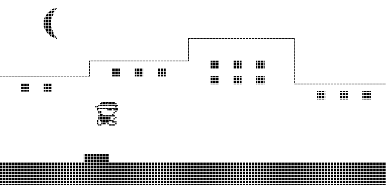

I am a first year MSc student at ETH Zurich majoring in Robotics, Systems and Control. I am passionate about Artificial Intelligence, Data Science, Computer Science, and Physics. My research interests broadly include Deep Learning, Reinforcement Learning, and Natural Language Processing. Currently, I am doing my semester project in the [Institute for Dynamic Systems and Control at ETH Zurich](https://idsc.ethz.ch/), working on building a robot that solves the [Labyrinth game](https://en.wikipedia.org/wiki/Labyrinth_(marble_game)) for multiple balls.

Previously, I graduated from the Indian Institute of Technology Madras with a dual degree in [Engineering Physics](https://physics.iitm.ac.in/program/3) (B.Tech) and [Data Science](https://ioe.iitm.ac.in/program/data-science/) (M.Tech). In my junior year, I received the prestigious [IITM Young Research Fellowship](https://yrf.iitm.ac.in/) to work on a year-long funded research project. Through the program, I worked with [Prof. Avhishek Chatterjee](https://sites.google.com/site/avhishek1984/) from the Electrical Engineering Department on the project "Achieving near-capacity performance on queue-channel systems with waiting-time dependent errors". For my thesis project, I worked with [Prof. Balaraman Ravindran](http://www.cse.iitm.ac.in/~ravi/) from the Computer Science Department on the project ["Matching options to tasks using Option Indexed Hierarchical Reinforcement Learning."](https://dl.acm.org/doi/abs/10.5555/3545946.3599025)

In the past, I have worked as a signal processing intern at Texas Instruments, where I performed system modeling and signal level simulation of 10BaseT1S automotive ethernet in MATLAB. I have also worked as an Applied Scientist intern at Amazon in the Finance Automation team, where I worked in both supervised and unsupervised anomaly detection. Apart from doing the coursework at IIT Madras, I regularly learn various topics via MOOCs and constantly seek to improve myself. 

For more details about my projects and experience, please check out my [CV](Aniruddha_CV.pdf) and [GitHub page](https://github.com/s-aniruddha).

## News

* Sep 2023: Started my journey at ETH Zurich.
* Jul 2023: Graduated from IIT Madras with a [Dual Degree](IITM_gradecard.pdf)!
* Aug 2022: Started my dual degree thesis project on Hierarchical RL.
* Jul 2022: Completed my [Amazon Internship](amazon_internship_letter.pdf) and received a pre-placement offer to join full-time!
* Jul 2021: Completed my [Texas Instruments Internship](TI_Internship_letter.pdf) and received a pre-placement offer to join full-time!
* Aug 2020: Selected for the inaugural cohort of the IITM Young Research Fellow Program!

## Projects

* **Option-Indexed Hierarchical Reinforcement Learning:** We learn an affinity function between options and the items present in the environment. This allows us to effectively reuse a large library of pre-trained options (lifelong learning setting) in zero-shot generalization at test time by restricting goal-directed learning to only those options relevant to the task at hand. This project is a collaboration between IIT Madras and Google Research, India. 
I ideated and implemented a co-occurrence-based representation for options to match them to tasks efficiently. [Here](https://github.com/s-aniruddha/Option-Indexed-Hierarchical-RL) is a presentation I made to summarize the salient points in our work.

* **Optimization:**  I made an academic poster for a group project in the course EE5121 Convex Optimization. It encapsulates key results from the paper [How Does Batch Normalization Help Optimization?](https://papers.nips.cc/paper/2018/hash/905056c1ac1dad141560467e0a99e1cf-Abstract.html) by Shibani Santurkar, Dimitris Tsipras, Andrew Ilyas, and Aleksander Madry. Check it out [here.](https://github.com/s-aniruddha/EE5121-Optimization-Project)

* **Achieving near-capacity performance in queue-channel systems with waiting-time dependent errors:** As part of the IITM Young Research Fellow Program, I designed error control coding schemes that achieve high data rates and make bits/qubits robust to noise in queue-channel systems with waiting-time dependent errors by adapting the convolutional encoder and the BCJR decoder to suit this channel. [Here's](https://github.com/s-aniruddha/Young-Research-Fellow) an academic poster I made to summarize my work.

* **Linear Algebra:** I reproduced the numerical results of the paper [Estimation of the bilinear form y\*f(A)x for Hermitian matrices](https://www.sciencedirect.com/science/article/pii/S002437951500511X)
by P. Fika and M. Mitrouli. The key idea is to estimate bilinear forms of f(A) without explicitly calculating f(A) by extrapolating the moments y\*f(A)x. Check out the detailed report [here](https://github.com/s-aniruddha/EE5120-Linear-Algebra-Project).

* **Nand2Tetris:** I completed the "Build a Modern Computer from First Principles: Nand to Tetris Part I and Part II" from Coursera. In the first six projects, I started with logic gates and built the hardware part of a fully functioning general-purpose modern computer. In the next six projects, I built a modern software hierarchy that can translate and execute object-based, high-level languages on a bare-bone computer hardware platform. I also implemented a virtual machine and a compiler for a Java-like programming language (Jack). In project 9, I built a rudimentary runner game (similar to Google’s Trex run) in the Jack language. You can find my code for all assignments on my GitHub page [here](https://github.com/s-aniruddha/nand2tetris).

* **Programming, Data Structures and Algorithms Using Python:** I made a series of [Jupyter notebooks](https://github.com/s-aniruddha/Programming-Data-Structures-and-Algorithms-Using-Python-NPTEL) while doing the NPTEL course to aid my learning. They may be helpful for anyone who is looking to get started with coding in python and learn basic data structures and algorithms.

## MOOCs

The following is a list of online courses that I completed. I recommend these courses to anyone interested in these topics!

1. [Introduction to Operations Research](https://archive.nptel.ac.in/noc/Ecertificate/?q=NPTEL22MG30S4446292602079149) from NPTEL
2. [Design and Analysis of Algorithms](https://archive.nptel.ac.in/noc/Ecertificate/?q=NPTEL22CS27S43314749NPTEL2201036605) from NPTEL
3. [Deep Learning Specialization (5 courses)](https://www.coursera.org/account/accomplishments/specialization/certificate/NH6VGFBMAQPP) from Coursera and Deeplearning.ai
4. [CS-191x Quantum Mechanics and Quantum Computation](https://courses.edx.org/certificates/02497e362b344c0e8fe65c86959f256f) from edX and UC Berkeley
5. [Build a Modern Computer from First Principles: From Nand to Tetris Part I](https://www.coursera.org/account/accomplishments/certificate/C6P34Z5ZXWJN) from Coursera and The Hebrew University of Jerusalem
6. [Build a Modern Computer from First Principles: From Nand to Tetris Part II](https://www.coursera.org/account/accomplishments/certificate/RRUU4BYAR8MV) from Coursera and The Hebrew University of Jerusalem
7. [Programming, Data Structures and Algorithms Using Python](https://archive.nptel.ac.in/noc/Ecertificate/?q=NPTEL19CS40S21183254191131470) from NPTEL
8. [DAT208x: Introduction to Python for Data Science](https://courses.edx.org/certificates/c2247d8b606042ab914b75d4891499c4) from edX and Microsoft

--------------------------------------------------------------------------------------------------------------------------
[CV](Aniruddha_CV.pdf) | [LinkedIn](https://www.linkedin.com/in/aniruddha-sundararajan/) 

